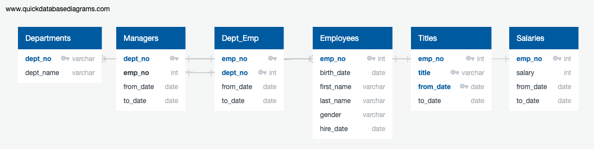

# Bootcamp: UCB-VIRT-DATA-PT-03-2020-U-B-TTH
## Bootcamp Challenge #7 - 4/26/2020
Bootcamp Challenge 7: Module pewlett-hackard-analysis

### Dataset Used
- [departments.csv](https://courses.bootcampspot.com/courses/140/files/35977)
- [dept_emp.csv](https://courses.bootcampspot.com/courses/140/files/35983)
- [dept_manager.csv](https://courses.bootcampspot.com/courses/140/files/35979)
- [employees.csv](https://courses.bootcampspot.com/courses/140/files/36133)
- [salaries.csv](https://courses.bootcampspot.com/courses/140/files/36560)
- [titles.csv](https://courses.bootcampspot.com/courses/140/files/36723)

### Challenge Description
Bobby’s new assignment consists of three parts: two additional analyses and a technical report to deliver the results to his manager. To help him complete these tasks, you will submit the following deliverables:

- Delivering Results: A README.md in the form of a technical report that details your analysis and findings
- Technical Analysis Deliverable 1: Number of Retiring Employees by Title. A table containing the number of employees who are about to retire, grouped by job title (and the CSV containing the data)
- Technical Analysis Deliverable 2: Mentorship Eligibility. A table containing employees who are eligible for the mentorship program (and the CSV containing the data)
- Table 1 will contain the number of current employees who are about to retire, grouped by job title.
- Table 2 will list those employees from Table 1 who are eligible for the mentorship program.

### Challenge Findings
#### EmployeeDB ERD

#### .CSVs Generated
[emp_eligibility](./analysis/emp_eligibility.csv)
 
[emp_history](./analysis/emp_history.csv)
 
[emp_titles](./analysis/emp_titles.csv)
 

### Pewlett Hackard Raw Data Table Name: Description
These tables were created to support the raw data import .CSV files. These are the raw data files obtained from the enterprise 
- employees: Information on each employee of Pewlett Hackard including full name, birth date, an unique employee number, gender, and his corresponding hire date. This table is where the unique employer number originates from.
- titles: The primary key is formed from a composite of the emp_no, title, and from_date because the same employee could have had different titles, or same title at different times; consequently, all three are required for an unique title entry. This table also provides the corresponding ending date of that title. If the title is the current title for that employee, the end_date is set to a future date of '9999-01-01'.
- salaries: This table holds all the salaries for the employees of Pewlett Hackard. In this table the primary key is emp_no, unlike the titles table that used three columns for a composite key. This implies that the company never gives out salary increases, instead only offering title changes. This table holds the dates that salary for that employee was valid for.
- departments: Simple table that maps the company's nine departments to a unique department number.
- dept_emp: Primary key is a composite of the unique employer number (foreign key to the Employers table) and the unique deptartment number (foreign key to departments table). This table holds the employees for the different departments.
- dept_manager: Primary key is a composite of the unique employer number (foreign key to the Employers table) and the unique deptartment number (foreign key to departments table). This table holds the managers for the different departments.

### PostGres Queries: Dynamic Tables generated:

#### Table: emp_history
**Description**
This purpose of the emp_history query is to combine various fields regarding the same employee into a new table. It uses three inner joins to get data from employees, titles, dept_emp, and salaries tables - all joined on the unique emp_no. This table holds the relevant info for employees accounting for all their various titles held within the company.
 
**Query**
SELECT 
	emp.emp_no,
	emp.first_name,
	emp.last_name,
	ti.title,
	ti.from_date,
	sa.salary
INTO emp_history
FROM employees AS emp
INNER JOIN titles ti ON emp.emp_no = ti.emp_no
INNER JOIN dept_emp de ON emp.emp_no = de.emp_no
INNER JOIN salaries sa ON emp.emp_no = sa.emp_no
WHERE de.to_date = '9999-01-01';
 
#### Table: emp_titles
**Description**
The emp_titles table is a partition table from emp_history, accounting only for the most recent (current) employee title.

 
**Query**
SELECT emp_no,
 first_name,
 last_name,
 title,
 from_date
INTO emp_titles
FROM
 (SELECT emp_no,
 first_name,
 last_name,
 title,
 from_date, ROW_NUMBER() OVER
 (PARTITION BY (emp_no)
 ORDER BY from_date DESC) rn
 FROM emp_history
 ) tmp WHERE rn = 1
ORDER BY emp_no;
 

#### Table: emp_eligibility
**Description**
The emp_eligibility holds rows for all the employees taking into account their current title info as held in emp_titles table. There is a layer of filtering applied to the employee's birth dates to take into account only those emplloyees born in 1965.
 

**Query**
SELECT 
	emp_title.emp_no,
	emp_title.first_name,
	emp_title.last_name,
	emp.birth_date,
	emp_title.title,
	emp_title.from_date,
	de.to_date
INTO emp_eligibility
FROM emp_titles AS emp_title
INNER JOIN dept_emp de ON emp_title.emp_no = de.emp_no
INNER JOIN employees emp ON emp.emp_no = emp_title.emp_no
WHERE de.to_date = '9999-01-01' AND (emp.birth_date BETWEEN '1965-01-01' AND '1965-12-31');
 

### Challenge Analysis
For the week 7 challenge, we were instructed to assist Bobby's manager to determine how many roles will soon need to be filled as the "silver tsunami" begins to make an impact at his enterprise employer: Pewlett Hackard. The silver tsunami refers to the phenomenon they are experiencing as a significant proportion of their employees are set to retire, leaving major gaps to fill littered across the enterprise. Bobby's manager is interested in getting the full list of current employees born in 1965, making them eligible for retirement. 

To analytically answer this request, we started with the datasets obtained in .CSV form for the tables as described above in the Table Names: Description section.

In your second paragraph, summarize the steps that you took to solve the problem, as well as the challenges that you encountered along the way. This is an excellent spot to provide examples and descriptions of the code that you used.

In your final paragraph, share the results of your analysis and discuss the data that you’ve generated. Have you identified any limitations to the analysis? What next steps would you recommend?
